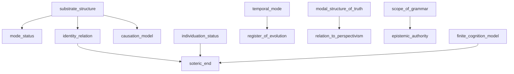
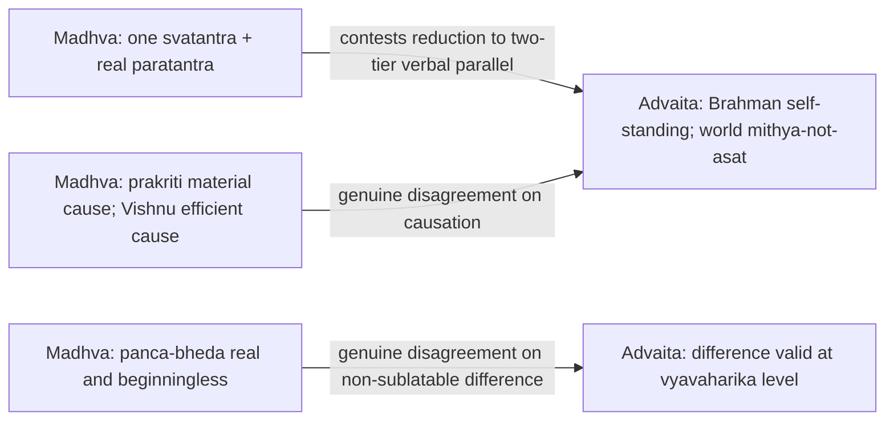
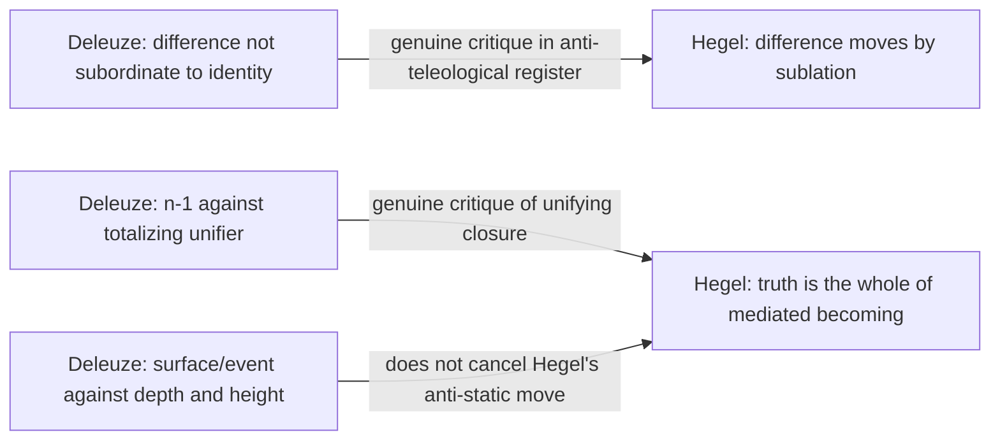
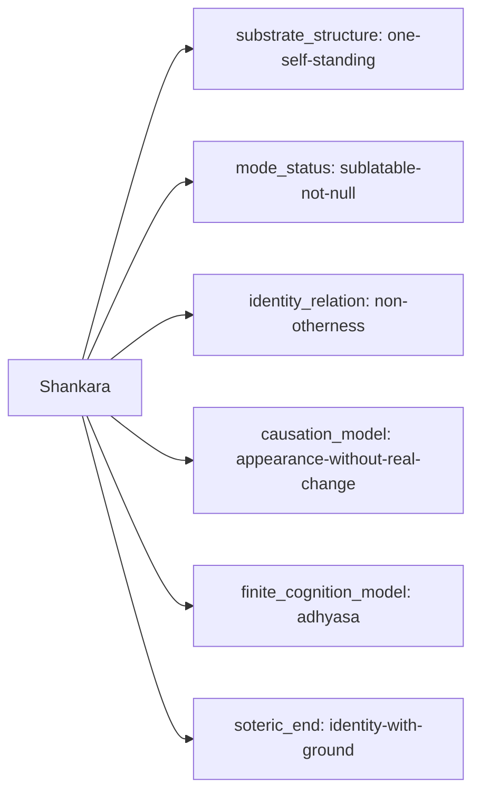
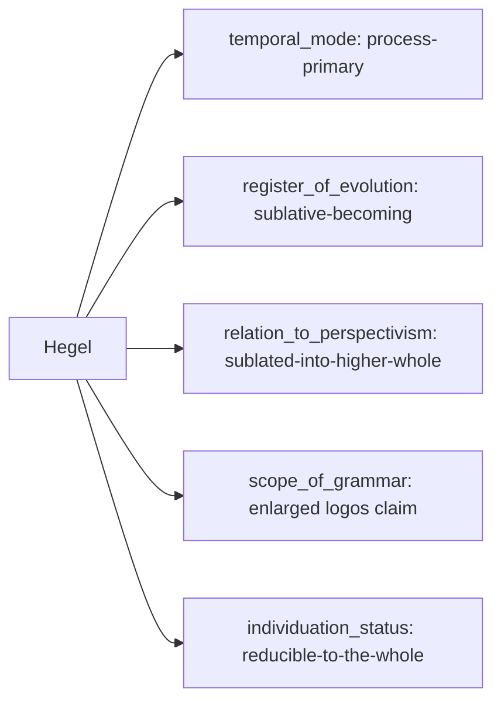

# Primitive Graph
## §1 — What the graph is for
The graph is a discipline of representation.
It does not decide which school is right.
It gives each claim a stable address:
- a primitive node
- a value on that node
- an edge showing dependence, commitment, subsumption, or critique
That address lets the site do four things without distortion:
1. locate a disagreement
2. show when one dispute is nested inside another
3. separate register shifts from ontological shifts
4. mark a false dispute when the conflict is verbal rather than structural
Three edge-types matter from the start.
- `dependency`: one primitive requires another for its intelligible use
- `commitment`: a thinker or school takes a value on a primitive
- `subsumption/critique`: one articulated position contains, narrows, displaces, or attacks another in a named register
The graph is PDG-like in one respect.
Some primitives are definitionally downstream from others.
The graph is not PDG-like in another respect.
Thinkers do not inherit a single total state from one root node.
They occupy a pattern of primitive-values across multiple registers.
This matters because real philosophical disagreements are not all of one kind.
Madhva and Śaṅkara do not disagree in the same way that Deleuze and Hegel disagree.
Nor does K.C. Bhattacharyya's alternative-truth claim sit on the same axis as Whitehead's process claim.
The graph keeps those differences visible.
---
## §2 — The primitive nodes
The graph uses thirteen primitives.
Each primitive has:
- a definition
- a bounded range of values
- a read-off rule
- a register-scope
The primitive is not a thesis.
It is the place where a thesis gets located.
### P1 — `substrate_structure`
Definition:
The basic ontological architecture of what is self-standing and what is not.
Possible values:
- `one-self-standing`
- `one-qualified-by-real-internal-distinctions`
- `one-independent-plus-real-dependents`
- `many-coordinate-reals`
- `process-field-with-no-enduring-substrate`
- `no-single-architecture-asserted`
Read-off rule:
Read from passages that answer questions of aseity, self-standing reality, and the relation between the supreme and the rest.
Use explicit architecture claims, not loose metaphors.
Registers:
- metaphysical
- epistemological when the architecture sets the domain of valid cognition
- soteriological when liberation is a shift in ontological status
Anchor cases:
- Śaṅkara: `one-self-standing` with dependent empirical articulation; see the three-tier correction at `shankara.md:21-25`
- Rāmānuja: `one-qualified-by-real-internal-distinctions`; see `ramanuja.md:19`
- Madhva: `one-independent-plus-real-dependents`; see `madhva.md:70-95`
- Whitehead: `process-field-with-no-enduring-substrate`; compare `whitehead.json:65`
### P2 — `mode_status`
Definition:
The status of the world, its parts, or dependent entities relative to what grounds them.
Possible values:
- `self-standing-real`
- `dependent-real`
- `sublatable-not-null`
- `real-transformation`
- `expressive-manifestation`
- `suspended-or-unfixed`
Read-off rule:
Read from claims about whether the world is real, dependent, illusory, sublatable, expressive, or transformed.
Do not infer from devotional tone.
Look for explicit ontological disclaimers such as `mithyā ≠ asat`, `satya`, `pariṇāma`, `ābhāsa`, or `prapañca = bheda-pañcaka`.
Registers:
- metaphysical
- epistemological
- aesthetic where manifestation is treated as expressive disclosure
Anchor cases:
- Śaṅkara: `sublatable-not-null`; `shankara.md:21-25`
- Madhva: `dependent-real`; `madhva.md:87-95`, `madhva.md:101-113`
- Abhinavagupta: `expressive-manifestation`; `abhinavagupta.json:44`
- Vallabha: `real-transformation`; `vallabha.json`
### P3 — `identity_relation`
Definition:
The formal relation between the supreme, the self, and the world where both unity and difference are at issue.
Possible values:
- `numerical-identity`
- `non-otherness`
- `body-soul-qualification`
- `image-original-similarity`
- `natural-difference-non-difference`
- `inconceivable-difference-non-difference`
- `self-expression-or-appearance`
- `no-single-relation-stated`
Read-off rule:
Read from explicit formulas used to gloss `tat tvam asi`, `bimba-pratibimba`, `aṃśa`, `aprthak-siddhi`, `svābhāvika-bhedābheda`, `acintya-bhedābheda`, `ābhāsa`, or the denial of any stable subject-object pairing.
Registers:
- metaphysical
- soteriological
- aesthetic where relation is figured as expression
Anchor cases:
- Śaṅkara: `non-otherness` is safer than flat `numerical-identity`; `shankara.md:146-148`
- Rāmānuja: `body-soul-qualification`; `ramanuja.md:50`, `ramanuja.md:68`
- Madhva: `image-original-similarity`; `madhva.md:35`, `madhva.md:39-40`
- Caitanya/Jīva: `inconceivable-difference-non-difference`; `caitanya.json:43`
### P4 — `individuation_status`
Definition:
The standing of the individual as individual.
Possible values:
- `reducible-to-the-whole`
- `qualified-mode`
- `irreducible-dependent`
- `expressive-singularity`
- `constructed-perspectival`
- `not-central`
Read-off rule:
Read from claims about whether individual selves are dissolved, preserved, qualified, expressive, or merely apparent.
This primitive must not be inferred from social ethics alone.
Registers:
- metaphysical
- soteriological
- ethical
- political
Anchor cases:
- Hegel: the individual as moment of Spirit; `hegel.md:109-115`
- Madhva: the `jīva` as real and permanently distinct; `madhva.md:72`, `madhva.md:107-113`
- Aurobindo: psychic being as irreducible center; `aurobindo.json:41`, `hegel.md:113-115` by contrast
- Deleuze: singularity not subordinated to identity; `deleuze.md:123-135`
### P5 — `causation_model`
Definition:
How the world or finite order issues from its ground, if it does.
Possible values:
- `appearance-without-real-change`
- `real-transformation`
- `unchanged-ground-with-changing-power`
- `body-soul-causation`
- `efficient-material-split`
- `immanent-expression`
- `processual-concrescence`
- `not-a-cosmogonic-system`
Read-off rule:
Read from causal chapters, not from later school summaries.
Prioritize explicit statements on material and efficient cause, and on whether change occurs in the ground, in a power, or only in appearance.
Registers:
- metaphysical
- cosmological
- soteriological when causal account constrains release
Anchor cases:
- Śaṅkara: `appearance-without-real-change`, but only with the article's caution about later `vivarta` hardening; `shankara.md:24`
- Rāmānuja: `body-soul-causation`; `ramanuja.json:50`
- Madhva: `efficient-material-split`; `madhva.md:139-145`
- Caitanya/Jīva: `unchanged-ground-with-changing-power`; `caitanya.md:421-425`
- Whitehead: `processual-concrescence`; `whitehead.json:65`
### P6 — `finite_cognition_model`
Definition:
The account of error, finitude, or bounded cognition.
Possible values:
- `adhyāsa-or-superimposition`
- `positive-ignorance`
- `real-dependent-veiling`
- `contraction-or-obscuration`
- `intentional-constitution`
- `perspectival-interpretation`
- `no-unified-model-given`
Read-off rule:
Read from arguments about illusion, ignorance, witness-consciousness, reduction, contraction, or interpretive perspectivism.
Do not confuse moral defect with epistemic structure.
Registers:
- epistemological
- metaphysical
- soteriological
Anchor cases:
- Śaṅkara: `adhyāsa-or-superimposition`; `shankara.md:47-103`
- later Advaita: `positive-ignorance`; `mandana.json:487-490`, `vidyaranya.json:48`
- Madhva/Jayatīrtha: `real-dependent-veiling`; `madhva.md:555-559`
- Abhinavagupta: `contraction-or-obscuration`; `abhinavagupta.json:44`
- Husserl: `intentional-constitution`; `husserl.json:104`
- Nietzsche: `perspectival-interpretation`; `nietzsche.json:221`
### P7 — `epistemic_authority`
Definition:
The dominant source or ordered set of sources by which supra-empirical claims are warranted.
Possible values:
- `scripture-dominant`
- `scripture-plus-transformative-experience`
- `plural-pramāṇa-realism`
- `dialectical-immanence`
- `phenomenological-reduction`
- `genealogical-critique`
- `no-single-authority`
Read-off rule:
Read from explicit pramāṇa claims, methodological prologues, or statements about what kind of access is final.
Registers:
- epistemological
- methodological
- soteriological
Anchor cases:
- Śaṅkara: `scripture-dominant`; `primitive-model.md:82` captured this part correctly
- Maṇḍana: `scripture-plus-transformative-experience`; `mandana.json:40`
- Madhva: `plural-pramāṇa-realism`; `primitive-model.md:84`, backed by `madhva.md`
- Hegel: `dialectical-immanence`; `hegel.json:39`
- Husserl: `phenomenological-reduction`; `husserl.json:104`
- Nietzsche: `genealogical-critique`; `nietzsche.md:260-262`
### P8 — `temporal_mode`
Definition:
Whether being is framed as substance, process, or both without reduction of one to the other.
Possible values:
- `substance-primary`
- `process-primary`
- `both-orthogonal`
- `timeless-ground-with-dependent-time`
- `no-decision-given`
Read-off rule:
Read from claims about becoming, duration, actual occasions, temporal manifestation, or the status of the eternal in relation to time.
Registers:
- metaphysical
- cosmological
- aesthetic
- political where temporal form structures action
Anchor cases:
- Bergson: `process-primary`; `bergson.json`
- Whitehead: `process-primary`; `whitehead.json:65`
- Hegel: `process-primary` in the form of mediated becoming; `hegel.md:80-89`, `hegel.md:241-247`
- Plato or static Vedānta would trend toward `substance-primary`
- Aurobindo and K.C.B. require `both-orthogonal`; `aurobindo.json:41`, `kc-bhattacharyya.json:117`
- Madhva gives `timeless-ground-with-dependent-time`, with time as dependent but real; `madhva.md:78-81`
### P9 — `register_of_evolution`
Definition:
How, if at all, emergence, development, or ascent is treated.
Possible values:
- `no-evolution`
- `sublative-becoming`
- `real-cosmological-evolution`
- `durational-creative-growth`
- `graded-manifestation-without-evolution`
- `not-applicable`
Read-off rule:
Read from explicit claims about history, cosmological development, involution/evolution, durée, or graded manifestation.
Registers:
- cosmological
- metaphysical
- soteriological
- political where history is given directional structure
Anchor cases:
- Hegel: `sublative-becoming`; `hegel.md:80-91`
- Aurobindo: `real-cosmological-evolution`; `aurobindo.json:41`
- Bergson: `durational-creative-growth`; `bergson.json`
- Abhinavagupta: `graded-manifestation-without-evolution`; `abhinavagupta.json:61`
- classical Advaita: usually `no-evolution` at the highest register
### P10 — `modal_structure_of_truth`
Definition:
How truth-claims relate when more than one valid standpoint is on the table.
Possible values:
- `single-absolute-truth`
- `hierarchical-standpoint-truth`
- `alternative-irreducible-truths`
- `paraconsistent-or-both-held`
- `context-indexed-without-final-hierarchy`
Read-off rule:
Read from explicit treatment of standpoint, rank-order, contradiction, or alternative valid formulations.
Registers:
- epistemological
- metaphysical
- methodological
Anchor cases:
- K.C. Bhattacharyya: `alternative-irreducible-truths`; `kc-bhattacharyya.md:238-246`
- classical Advaita: `hierarchical-standpoint-truth`
- Jain logic would push toward `paraconsistent-or-both-held`
- Nietzsche and Leibniz motivate `context-indexed-without-final-hierarchy` in different ways
### P11 — `relation_to_perspectivism`
Definition:
What becomes of multiple standpoints once they are recognized as multiple.
Possible values:
- `sublated-into-higher-whole`
- `irreducible-true-perspectives`
- `partial-perspectives-ranked`
- `perspectives-as-symptoms`
- `no-perspectivism-claim`
Read-off rule:
Read from explicit treatment of standpoint pluralism, monads, interpretation, or dialectical overcoming.
Registers:
- epistemological
- metaphysical
- political
- aesthetic
Anchor cases:
- Hegel: `sublated-into-higher-whole`; `hegel.md:80-91`
- Leibniz: `irreducible-true-perspectives`; see `leibniz.md` and `leibniz.json`
- Nietzsche: `perspectives-as-symptoms`, though not merely errors; `nietzsche.md:260-262`
- K.C.B.: `irreducible-true-perspectives` in a different idiom; `kc-bhattacharyya.md:244-246`
### P12 — `scope_of_grammar`
Definition:
What ontological or epistemic force is granted to conceptual or linguistic articulation.
Possible values:
- `grammar-as-discursive-tool`
- `grammar-as-mode-of-access`
- `grammar-as-constitutive-in-a-domain`
- `grammar-as-constitutive-of-reality-as-such`
- `anti-grammatical-reduction`
Read-off rule:
Read from passages about logos, proposition, sentence-form, language-world relation, or the constitutive scope of conceptual articulation.
Registers:
- methodological
- epistemological
- metaphysical
- aesthetic
Anchor cases:
- Nietzsche attacks `grammar-as-constitutive-of-reality-as-such`; `hegel.md:138-146`, `nietzsche.json:221`
- Hegel resists ordinary grammar yet still expands logos into ontology; `hegel.md:121-146`, `hegel.md:245`
- Bhartṛhari-type views would occupy `grammar-as-constitutive-in-a-domain` or stronger
- K.C.B. pushes `anti-grammatical-reduction`; `kc-bhattacharyya.md:305`, `kc-bhattacharyya.md:529`
- The apparatus should not collapse these into one debate
### P13 — `soteric_end`
Definition:
The end-state or highest achieved mode in the school's own terms.
Possible values:
- `identity-with-ground`
- `service-with-distinction-preserved`
- `loving-participation`
- `recognition`
- `transformation-of-life`
- `suspension-or-ataraxia`
- `not-soteriological`
Read-off rule:
Read from explicit chapters on mokṣa, freedom, beatitude, recognition, divine life, or practical consummation.
Registers:
- soteriological
- ethical
- aesthetic
- political where liberation has social extension
Anchor cases:
- Śaṅkara: `identity-with-ground`
- Madhva: `service-with-distinction-preserved`; `primitive-model.md:95` captured the broad point
- Caitanya: `loving-participation`
- Abhinavagupta: `recognition`
- Aurobindo: `transformation-of-life`
---
## §3 — The edges
### 3.1 Dependency edges
Some primitives can vary independently.
Some cannot.
The graph must show this.
`temporal_mode` and `substrate_structure` are independent.
A one-substance metaphysics may be static, processual, or both-orthogonal.
Spinoza, Hegel, and Whitehead prove the point from three sides.
`mode_status` depends on `substrate_structure`.
One cannot classify a world as `dependent-real` or `sublatable-not-null` without already having fixed what it depends on.
`register_of_evolution` depends on `temporal_mode`, but not the other way around.
One can say that time is basic without claiming a progressive evolution.
`relation_to_perspectivism` depends on `modal_structure_of_truth`.
To say that perspectives are sublated, preserved, or merely symptomatic presupposes some view of how truths coexist.
`soteric_end` depends on at least `individuation_status` and `identity_relation`.
If the individual is reducible, liberation will be described differently than if the individual is irreducible-dependent.
Dependency sketch:

### 3.2 Commitment edges
Each thinker article should carry a compact commitment table.
The master graph then aggregates those local commitments.
The commitment edge format is:
`[thinker] -> commits-to -> [primitive:value]`
with a citation.
Micro-sample:
| Thinker | Commitment | Citation |
| --- | --- | --- |
| Śaṅkara | `mode_status = sublatable-not-null` | `shankara.md:21-25`; [*Brahma-Sūtra-Bhāṣya* 2.1.14](cite://sankara/brahma-sutra-bhasya/2.1.14) |
| Śaṅkara | `substrate_structure = one-self-standing` | `shankara.md:21-25` |
| Madhva | `substrate_structure = one-independent-plus-real-dependents` | `madhva.md:70-95` |
| Madhva | `causation_model = efficient-material-split` | `madhva.md:139-145` |
| Hegel | `temporal_mode = process-primary` | `hegel.md:80-89`, `hegel.md:241-247` |
| Deleuze | `relation_to_perspectivism = irreducible-true-perspectives` is too crude; better: `sublated-into-higher-whole = rejected` | `deleuze.md:123-135`, `deleuze.md:253-285` |
### 3.3 Subsumption and critique edges
Subsumption is not identity.
Critique is not cancellation.
The edge must therefore carry:
- direction
- register
- verdict
- citation
The format is:
`[position A] -> critiques/subsumes? -> [position B] {register, verdict}`
#### Example A: Madhva and Advaita

Why this matters:
- `madhva.md:70-95` gives the aseity structure.
- `madhva.md:101-113` gives `pañcabheda` as real and beginningless.
- `madhva.md:139-145` gives the efficient/material split.
- `shankara.md:21-25` and `shankara.md:315-317` make clear that the Advaita side is not flat world-nullification.
The result is not "same structure, different vocabulary."
It is:
- some shared denial of independent secondness
- a real dispute over the status of difference
- a real dispute over causation
- a real dispute over whether the finite is sublatable or permanently real as finite
#### Example B: Deleuze and Hegel

Why this matters:
- Hegel's process claim is real; `hegel.md:80-89`, `hegel.md:109-115`
- Hegel's expansion of logic into ontology is also real; `hegel.md:121-146`, `hegel.md:245`
- Deleuze's objection is not that Hegel is static.
- It is that Hegel still subordinates difference to identity; `deleuze.md:123-135`
- Deleuze's `n-1` formula attacks the unifier, not becoming as such; `deleuze.md:279-284`
- Nietzsche sharpens the suspicion of philosophical drives claiming the right to legislate the whole; `nietzsche.md:260-262`
So the critique is mixed.
Deleuze does not erase Hegel's break with inert substance.
Hegel does not answer the charge that teleological sublation assigns non-identity only a provisional role.
That is a graphable relation, not a yes-or-no verdict.
---
## §4 — The four-verdict schema
The old four verdicts are kept.
They now classify subsumption/critique edges.
### V1 — `shared`
Two positions share the same commitment on a primitive, even if their larger systems diverge.
### V2 — `terminological`
Two positions carve the same local structure with different terms, or use the same term for different local work.
The classification is local.
It never licenses the claim that the systems as wholes are the same.
### V3 — `genuine`
The positions differ on the primitive itself, not just on its phrasing.
### V4 — `contested`
The corpus itself leaves open whether the edge is `terminological` or `genuine`, or whether the source base is too unstable to decide.
### Worked example 1: Madhva ↔ Advaita
Local claim set:
- Madhva: Viṣṇu alone is `svatantra`; all else is real but `asvatantra`; `madhva.md:70-95`
- Madhva: the world is `pañcabheda`; `madhva.md:101-113`
- Advaita: Brahman alone is self-standing; the world is `mithyā` but not `asat`; `shankara.md:21-25`
- Advaita: empirical difference is affirmed in its own register; `shankara.md:315-317`
Verdicts:
- On denial of independent secondness: `shared`
- On the claim that the finite is merely a lower-order reality while difference is sublatable: `genuine`
- On the thought that both systems recognize a higher and lower register: `terminological` only in a narrow and carefully marked sense
- On polemical charges that Advaita makes the world sheer non-being: `contested`
The older framework treated the narrow `terminological` edge as the headline.
That is the wrong order.
The headline disagreement is the status of real difference.
### Worked example 2: Deleuze ↔ Hegel
Local claim set:
- Hegel: the true is the whole that becomes itself; `hegel.md:80-89`
- Hegel: living substance is subject; `hegel.md:109-115`
- Hegel: ordinary predication breaks down, but speculative logic remains truth-bearing; `hegel.md:121-146`
- Hegel: becoming is read off the movement of being and nothing; `hegel.md:241-247`
- Deleuze: difference is shackled when subordinated to identity; `deleuze.md:123-135`
- Deleuze: the multiple must be made by subtraction of the unifier; `deleuze.md:279-284`
- Deleuze: surface/event blocks both depth-metaphysics and height-metaphysics; `deleuze.md:377-427`
Verdicts:
- On whether reality is static substance: `shared` denial
- On whether difference is absorbed into a higher identity: `genuine`
- On whether Hegel already breaks ordinary subject-predicate grammar: `contested` only if one forgets the speculative proposition; otherwise `shared` anti-naivete with a later fork
- On whether a richer logic can still track reality: `genuine`
This is the right place to use register-language.
Deleuze's critique bites hardest in the anti-teleological and anti-totalizing registers.
It does not erase Hegel's anti-static achievement.
---
## §5 — Register discipline
No primitive-value should be assigned before the register of the claim is fixed.
The minimal registers for this site are:
- metaphysical
- epistemological
- soteriological
- ethical
- aesthetic
- political
One sentence may work in more than one register.
That is not a defect.
It is one reason the graph is needed.
Examples:
### Madhva on `bheda`
`madhva.md:101-113` is plainly metaphysical.
The world is structured by real fivefold difference.
`madhva.md:181-185` shows the same doctrine in an epistemic and practical register.
If difference were not real, practice and intelligibility would break.
The graph should therefore record:
- `mode_status = dependent-real` in the metaphysical register
- `finite_cognition_model` and `epistemic_authority` implications in the epistemological register
- `soteric_end = service-with-distinction-preserved` in the soteriological register
### Hegel on “the True is the Whole”
`hegel.md:80-89` is not only a metaphysical claim.
It is also a methodological claim about how cognition reaches adequacy.
If the sentence is read only as ontology, the method disappears.
If it is read only as method, the metaphysics disappears.
The graph therefore records one commitment with two registers rather than two unrelated commitments.
### K.C. Bhattacharyya on alternative truths
`kc-bhattacharyya.md:238-246` is epistemological first.
But it presses directly into metaphysics once alternative truth-forms are taken as irreducible.
To collapse it into a merely methodological liberalism would miss the point.
### Ramakrishna on roof and stairs
The roof-and-stairs doctrine is soteriological in its immediate setting.
It also bears on metaphysics if one infers from it a claim about static and dynamic reality.
The graph should not make that inference silently.
It should mark the inference as a later edge, not as a primitive-value read straight off the line.
Register discipline therefore has one hard rule:
Do not move from a pedagogical image to a metaphysical commitment without naming the step.
---
## §6 — Failure modes the framework explicitly avoids
### 1. Collapsing real disagreements into “saying the same thing”
This was the weakest tendency in the older framework.
The Madhva/Advaita case shows why.
Shared denial of independent secondness does not erase the dispute over real difference, causation, or the standing of the finite.
### 2. Inflating terminological variance into genuine forks
Not every lexical contrast marks a metaphysical split.
Different schools often reserve different terms for the same local structure.
The `terminological` verdict remains necessary.
But it must remain local.
### 3. Strawmanning a figure by attaching a later school position to an earlier author
Śaṅkara must not be assigned a fully crystallized Bhāmatī/Vivaraṇa locus debate as though it were his own explicit primitive tuple.
The graph therefore distinguishes:
- thinker
- sub-school
- later reconstruction
### 4. Treating the apparatus as if it already spoke from one privileged philosophical standpoint
The apparatus is not a manifesto.
It is the place where manifestos become comparable.
### 5. Collapsing the grammar question into one narrow complaint
The user's correction should remain visible:
> "ontologized grammar isn't Nietzsche's notion of grammar"
The framework accepts that correction.
Nietzsche's attack on grammar as a source of false substance-metaphysics is one issue.
The stronger complaint that one mode of articulation has been mistaken for reality's own structure is another.
The Bhartṛhari-style question whether language is constitutive in a positive sense is a third.
The graph keeps them apart.
---
## §7 — How thinker articles plug in
Each thinker article should gain a compact graph sub-block.
The purpose is not to restate the whole article.
It is to give the article a machine-readable and reader-readable commitment surface.
Minimum format:
1. a five-to-eight row commitment table
2. one Mermaid block
3. citations to the primary text or the on-disk article's cited locus
### Example A: Śaṅkara
| Primitive | Value | Register | Citation |
| --- | --- | --- | --- |
| `substrate_structure` | `one-self-standing` | metaphysical | `shankara.md:21-25` |
| `mode_status` | `sublatable-not-null` | metaphysical | `shankara.md:21-25` |
| `identity_relation` | `non-otherness` | metaphysical | `shankara.md:146-148` |
| `causation_model` | `appearance-without-real-change` | cosmological | `shankara.md:24`; [*Brahma-Sūtra-Bhāṣya* 2.1.14](cite://sankara/brahma-sutra-bhasya/2.1.14) |
| `finite_cognition_model` | `adhyāsa-or-superimposition` | epistemological | `shankara.md:47-103` |
| `soteric_end` | `identity-with-ground` | soteriological | `shankara.md:653-657` |

### Example B: Hegel
| Primitive | Value | Register | Citation |
| --- | --- | --- | --- |
| `temporal_mode` | `process-primary` | metaphysical | `hegel.md:80-89`, `hegel.md:241-247` |
| `register_of_evolution` | `sublative-becoming` | metaphysical | `hegel.md:80-91` |
| `relation_to_perspectivism` | `sublated-into-higher-whole` | epistemological | `hegel.md:80-89` |
| `scope_of_grammar` | `grammar-as-mode-of-access` tending toward stronger logos-claims | methodological | `hegel.md:121-146`, `hegel.md:245` |
| `individuation_status` | `reducible-to-the-whole` | metaphysical | `hegel.md:109-115` |

The rollout rule is simple.
Add these sub-blocks gradually.
Do not force every article into the graph at once.
The graph is useful only if each assignment stays cited, local, and corrigible.
